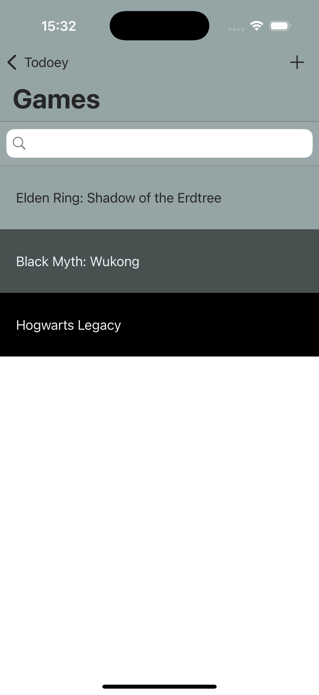

# Installation Instructions

To run the project on your local machine, follow these steps:

### **1. Clone the Repository**
Clone this repository to your local machine:
```bash
git clone https://github.com/elismailov/todoey.git
```

### **2. Install CocoaPods Dependencies**
The project uses CocoaPods for dependency management. To install the required dependencies:
1.	Navigate to the project directory:
```bash
cd todoey
```
2.	Run the following command:
```bash
pod install
```
3.	Open the generated .xcworkspace file:
```bash
open todoey.xcworkspace
```

## *Install CocoaPods*
First Time CocoaPods Users: If you don’t have CocoaPods installed, you can install it using:
```bash
sudo gem install cocoapods
```
Make sure to run pod install after cloning the repository to set up the necessary libraries.

# Screenshots

<p align="center">
  
  &nbsp;
  
</p>